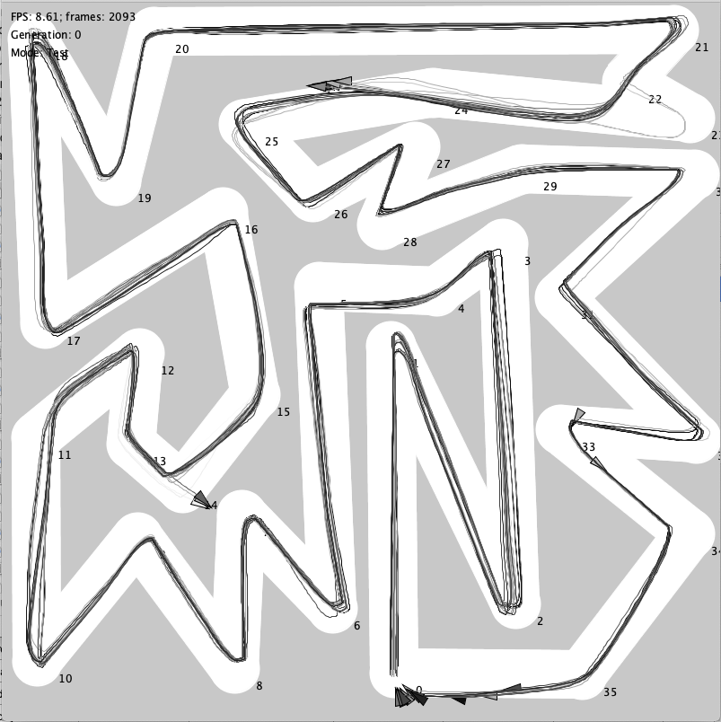

This is a Processing program for creating race tracks.

An example of its use can be found [here](https://github.com/iiliev/processing_neural_network_race_car_example).

For the available keyboard and mouse commands check out create_track.pde.